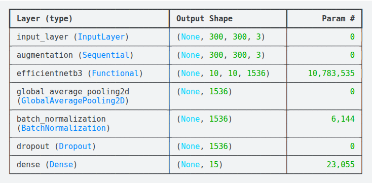
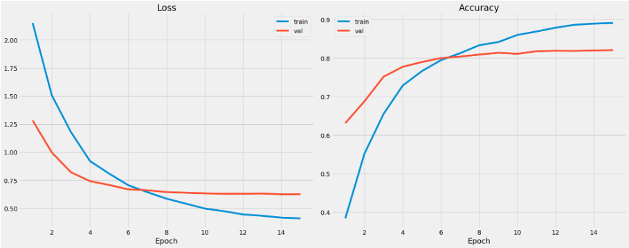

# Human Action Recognition (EfficientNetB3)

Train an ImageNet-pretrained **EfficientNetB3** classifier to recognize **human actions** from images (TensorFlow/Keras).

## Kaggle

- **Dataset**: 
    `https://www.kaggle.com/datasets/meetnagadia/human-action-recognition-har-dataset`
- **Notebook**: 
    `https://www.kaggle.com/code/mehrabgheibi/har-accuracy-82`

## Highlights

- **Backbone**: EfficientNetB3 (ImageNet weights)
- **Training**: two-stage (warm up head → fine-tune backbone)
- **Input pipeline**: fast `tf.data`, augmentation, optional MixUp
- **Performance**: mixed precision + cached validation set

## Sample images

<table>
  <tr>
    <td align="center"></td>
    <td align="center"></td>
    <td align="center"></td>
  </tr>
  <tr>
    <td align="center">Cycling</td>
    <td align="center">Laughing</td>
    <td align="center">Using laptop</td>
  </tr>
</table>

## Dataset

- **Kaggle dataset**: `https://www.kaggle.com/datasets/meetnagadia/human-action-recognition-har-dataset`

Expected structure:

```text
.../Human Action Recognition/
  train/              # images
  Training_set.csv    # columns: filename,label
```

## Run (Kaggle) — recommended

1. Create a Kaggle notebook (GPU recommended).
2. Add the dataset: `https://www.kaggle.com/datasets/meetnagadia/human-action-recognition-har-dataset`
3. Open the notebook: `https://www.kaggle.com/code/mehrabgheibi/har-accuracy-82` (or upload/run `human-action-recognition.ipynb`).

## Model summary

EfficientNetB3 (ImageNet pretrained) with a lightweight classification head:

- Backbone: **EfficientNetB3** (`include_top=False`)
- Head: **GlobalAveragePooling2D → BatchNorm → Dropout → Dense(softmax)**
- Mixed precision enabled; softmax output kept in **float32** for numerical stability



## Training curves

Train/validation **loss** and **accuracy** across epochs (two-stage training: warmup head → fine-tune backbone):


